# Falcon Eye System

Falcon Eye is an AI-powered drone-assisted search and rescue system designed to improve search operations in desert environments. The system combines a Flutter mobile application, a Python backend, and computer vision models to detect missing persons, estimate movement directions, and provide operators with mission support tools.

---

## Features

- Secure user authentication
- Mission management and briefing
- Live video feed monitoring
- AI-based human detection
- Target profile generation
- Suggested movement direction
- Mission confirmation workflow
- Mission history
- Interactive map view
- Search grid visualization
- Mission completion summary

---

## System Architecture

The project consists of two main components:

### Flutter Application
- User authentication
- Mission dashboard
- Live mission interface
- Interactive maps
- Target confirmation
- Mission history

### Python Backend
- Video processing
- AI inference
- Detection pipeline
- Mission data management
- API communication with Flutter

---

## Prototype Note

This project was designed to support real-time drone integration using the DJI Mobile SDK.

Due to the unavailability of a physical DJI drone during development, the current prototype uses a pre-recorded video stream on the backend to simulate the drone's live camera feed. This approach allowed the AI detection pipeline, backend processing, and Flutter application to be fully developed and tested.

The system architecture has been designed so that replacing the simulated video stream with an actual DJI live feed requires minimal modifications.

---

## Project Structure

```
falcon-eye-system/
│
├── FalconEyeFlutter/
│
├── falconeye_backend/
│
├── README.md
```

---

## Application Screens

### Login Screen
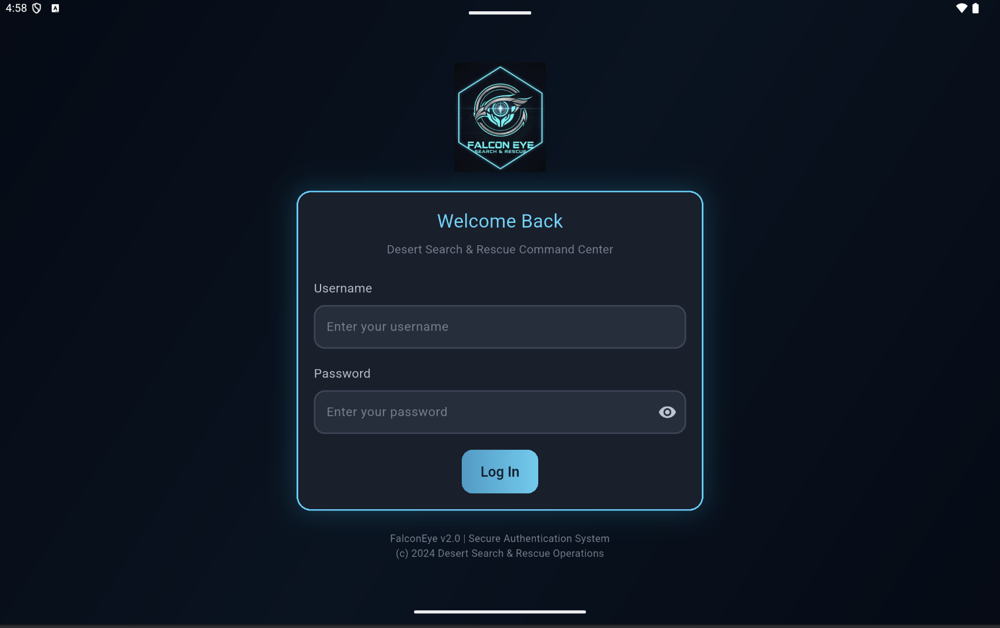

### Home Dashboard
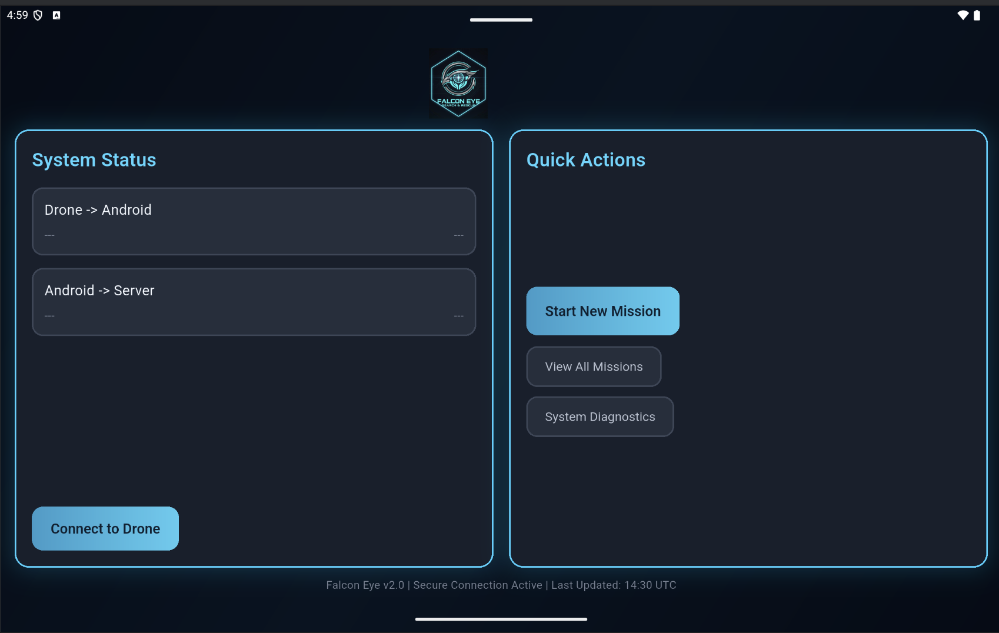

### System Overview
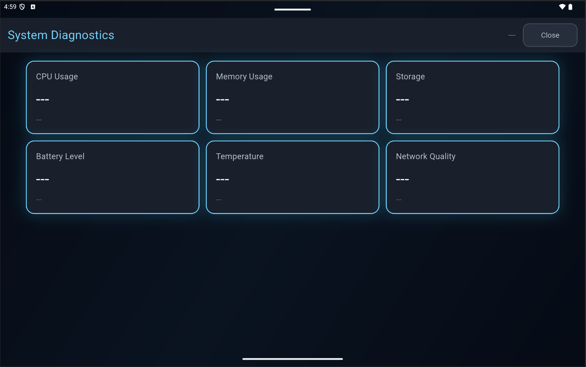

### Mission History
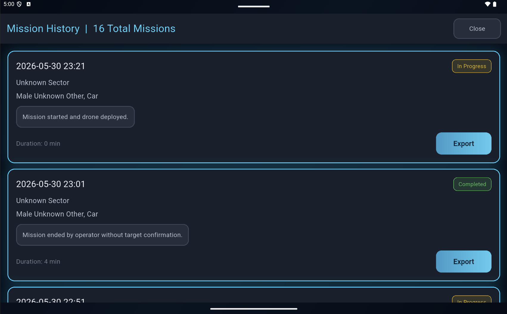

### Mission Briefing
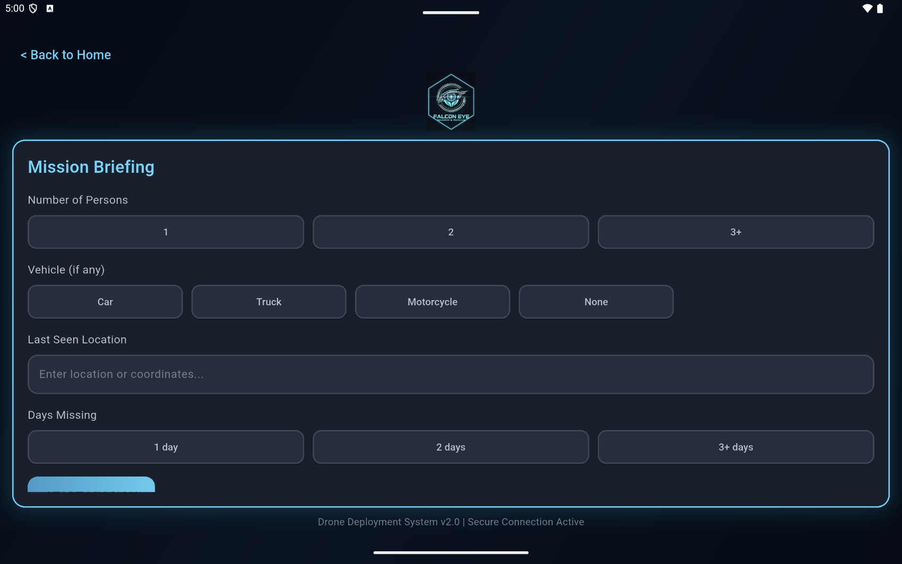

### Target Profile
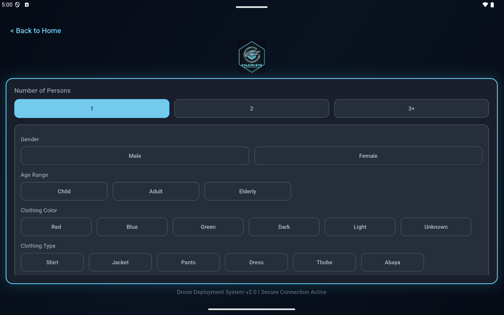

### Additional Target Profile
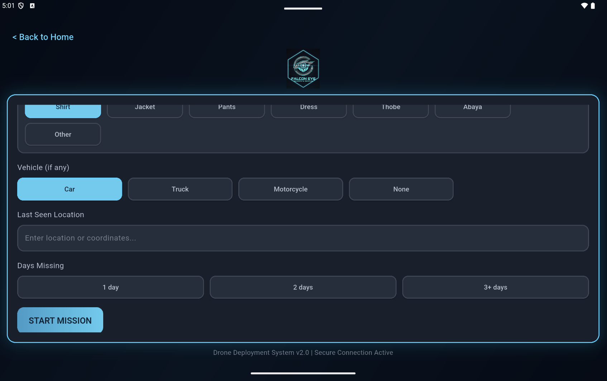

### Live Video Feed
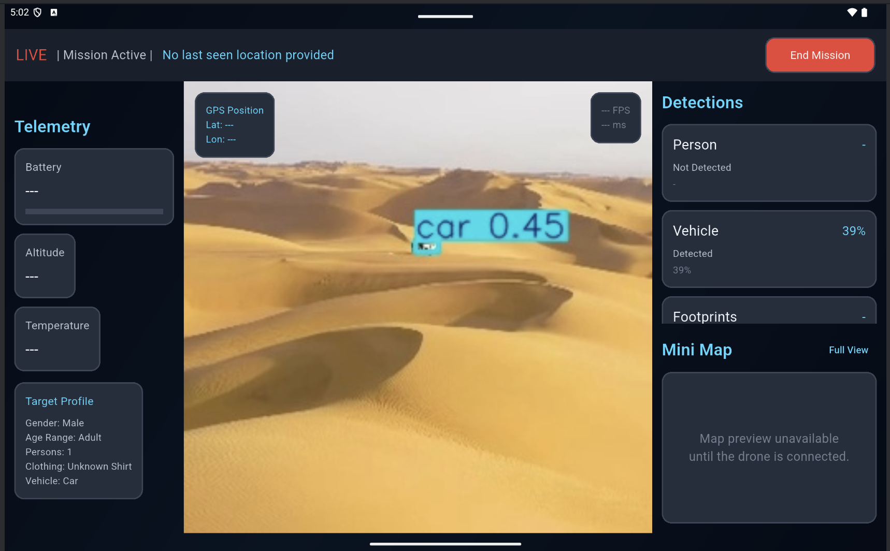

### AI Movement Suggestion


### Target Confirmation
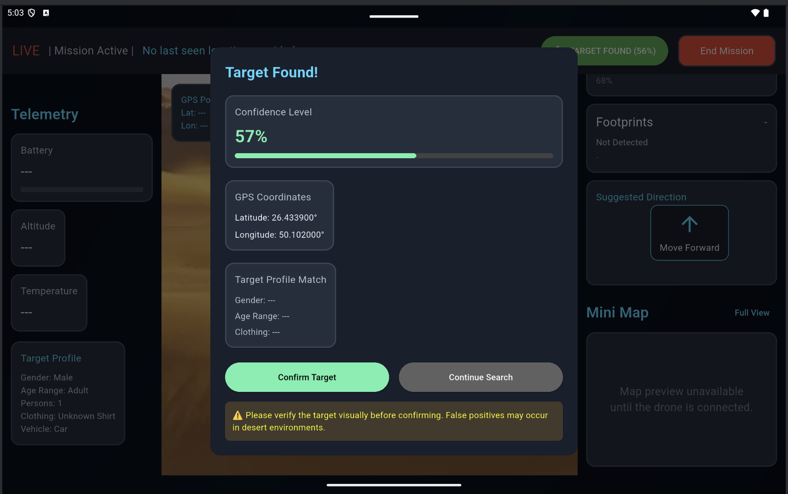

### Mission Completed
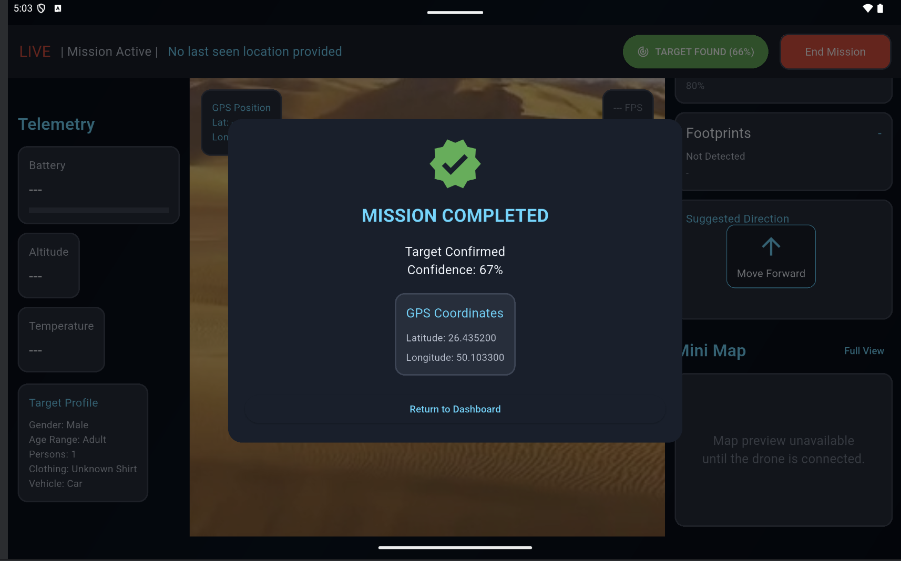

### Map View
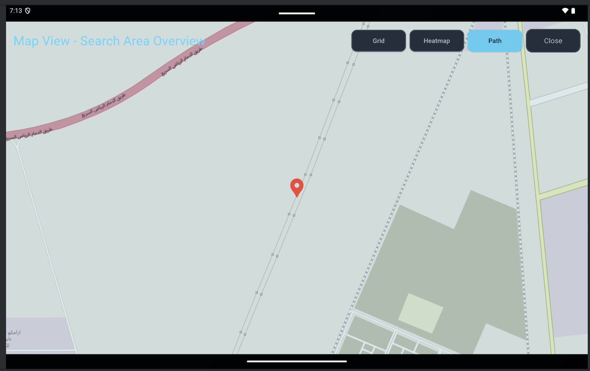

### Search Grid View
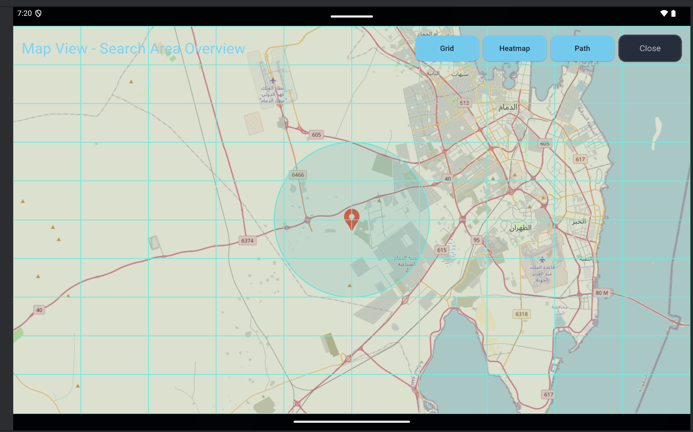

---

## Future Improvements

- Integrate the DJI Mobile SDK for real-time drone communication.
- Replace the simulated video stream with a real drone camera feed.
- Support autonomous drone navigation.
- Improve AI detection accuracy.
- Enable multi-drone coordination.
- Add real-time notifications and mission analytics.

---

## Technologies Used

### Frontend
- Flutter
- Dart

### Backend
- Python
- Flask

### AI & Computer Vision
- YOLO
- OpenCV

### Maps
- Flutter Map
- OpenStreetMap

---

## Team

Developed as a graduation project by the Falcon Eye team.
